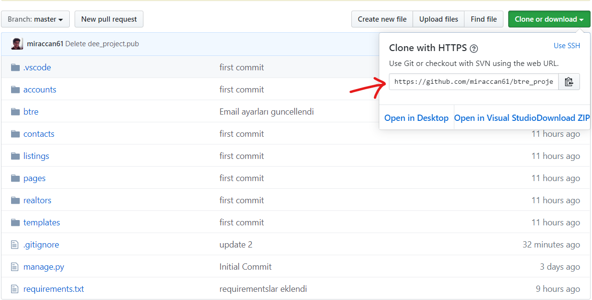
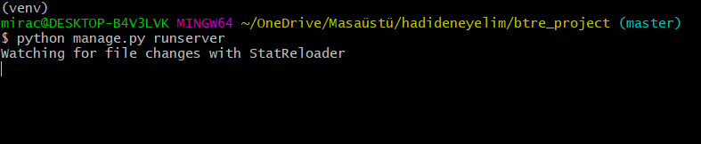

# Btre Project 

## In this project. I watched [this series](https://subscription.packtpub.com/video/application_development/9781838641283/100456/100466/welcome-to-the-course)

# What I learned:
- Create Django App
    -  what it works 'django-admin help' 
- Customize admin panel
- Pagination and How works search field 
- Preserving Form Input and Save to Database
- User authentication process(register-login-logout)
  - When user register successfully. I showed a Message Alerts
- Contact Inquiries
  - Contact form submission
  - Inquiry check and send email with SMTP 

# Requirements
  - Python3.6+(with pip) .you can download [this link](https://www.python.org/)
  - Git bash(I recommend that).you can download [this link](https://git-scm.com/downloads)
  - Vscode(I recommend this interpreter because it has many useful extension). You can download [this link](https://code.visualstudio.com/)
  

###  I didn't want to publish this project but If you want to publish you can keep going on this [site](https://gist.github.com/bradtraversy/cfa565b879ff1458dba08f423cb01d71)

## If you want to download this project and develope that project on your pc  
- Create a Folder on Desktop and enter to Folder. You should use  and it will download to your folder.
    ``` 
    git clone # http links paste here
    ```
-  After you should install virtualenv. If you don't know virtualenv [click me](#virtualenv)
-  you should install requirements.txt in your folder you can use below command 
    ```
    pip install -r requirements.txt
    ```
- right now we have all requirements and we should create our database tables
    ```
    #if you change your model you should start this command first but now not necessary
    python manage.py makemigrations
    after you should create your dbtable run this command
    python manage.py migrate
    ```
    Output should be like this
    
- and you are ready let's start
  ```
    python manage createsuperuser #create admin account
    python manage.py runserver #run server and develope :)
  ```
- If you take this output everthing okey :) go your browser and write localhost:8000
  

# Virtualenv
## What is virtualenv?
- PIP is a package management system used to install and manage software packages written in Python. It stands for "preferred installer program" or "Pip Installs Packages". If you want to more detail [click](https://phoenixnap.com/kb/install-pip-windows)
- I recommend to use python3.6+. If you are using windows please select this  after install and you can use pip on command line(win)
- If you are using linux distrubutions you can use __apt package manager__ 
    ``` command
    sudo apt-get install python3.8  
    sudo pip install
    pip install virtualenv
    'virtualenv --version' # if you want to know version of virtual enviroment
    ```
- if you want to create your virtualenv. you can use this commands
    - If windows(you are Desktop/anyfolder) right now:
     ``` command
        virtualenv venv #Venv Creating wait 2 minute
        source venv/Scripts/activate #Activate your virtualenv
    ```
    - If linux(you are Desktop/anyfolder) right now:
     ``` command
        virtualenv venv #Venv Creating wait 2 minute
        source venv/bin/activate #Activate your virtualenv
     ```
  
